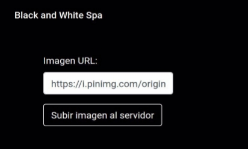
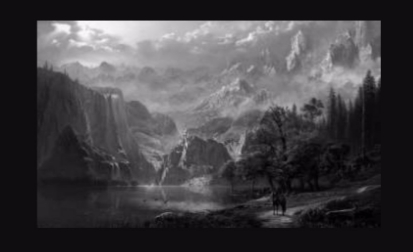



**Desafío - Black and White**

- Para realizar este desafío debes haber estudiado previamente todo el material disponibilizado correspondiente a la unidad.
- Una vez terminado el desafío, comprime la carpeta que contiene el desarrollo de los requerimientos solicitados y sube el .zip en el LMS.
- Desarrollo desafío:

○ El desafío se debe desarrollar de manera Grupal

Capítulos

El desafío está basado en los siguientes capítulos de la lectura:

- Interfaces de línea de comando con Yargs
- Procesamiento de imágenes con JIMP
- Bajando aplicaciones
- Devolviendo sitios web estáticos

Descripción

La empresa Black and White Spa está promocionando una campaña para las redes sociales en donde quieren ofrecer un sitio web que permita escribir la URLde una imagen de internet y que ésta sea procesada por el servidor para ser devuelta en blanco y negro.

Deberás crear un servidor que disponibiliza una ruta raíz que devuelva un HTML con el formulario para ingresar la URL de la imagen con estilos CSS de un documento interno en los archivos del servidor. El formulario debe redirigir a otra ruta del servidor que procese la imagen y la devuelva en blanco y negro. Como muestran las siguientes imágenes:

Requerimientos

1. El servidor debe ser levantado por instrucción de una aplicación Node que use el paquete Yargs para capturar los argumentos en la línea de comando. Se deberá ejecutar el comando para levantar el servidor solo si el valor de la propiedad “key”es la correcta (123).
1. El servidor debe disponibilizar una ruta raíz que devuelva un HTMLcon el formulario para el ingreso de la URL de la imagen a tratar.
1. Los estilos de este HTML deben ser definidos por un archivo CSS alojado en el servidor.
1. El formulario debe redirigir a otra ruta del servidor que deberá procesar la imagen tomada por la URL enviada del formulario con el paquete Jimp. La imagen debe ser procesada en escala de grises,con calidad a un 60%y redimensionada a unos 350px de ancho. Posteriormente debe ser guardada con nombre “newImg.jpg”y devuelta al cliente.
   **\_ PAGE3**

www.desafiolatam.com
